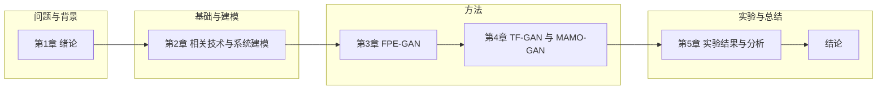

# 第1章 绪论

## 1.1 研究背景与意义

在数字化转型进程中，物联网（IoT）应用规模持续扩大，终端数量及其产生的数据量呈快速增长趋势 **[1]**。传统云计算以远程数据中心为主要承载，在面对物联网场景的海量接入、低时延与高频交互需求时，易受到长链路传输与集中处理模式的制约：其一，数据需从源端传输至远程中心再完成处理与返回，端到端链路延迟难以满足对时延敏感的业务；其二，集中上行带来显著的带宽占用与潜在拥塞，进而抬升通信开销与运营成本，并影响系统整体响应稳定性。

为缓解上述矛盾，边缘计算（Mobile Edge Computing, MEC）作为面向近端的计算范式被广泛关注 **[2]**。其基本思想是将计算与存储资源下沉部署至靠近数据源的网络边缘 **[3]**，使得数据能够在更靠近产生位置的节点完成预处理与推理等任务，从而降低跨域传输带来的时延与带宽压力，并提升面向实时业务的响应能力。

然而，在边缘侧实施高可靠服务仍面临多重挑战：

首先，**资源约束显著**。边缘节点与数据中心服务器相比，通常在计算、存储与能耗预算等方面更为受限 **[4]**，这使得复杂模型推理与多任务并发更易触发性能波动。

其次，**网络与安全环境复杂** [5]。边缘节点常处于动态、异构且不稳定的网络条件中，链路中断、节点失效与无线干扰等问题更为常见；同时，在开放环境下开展数据完整性验证存在较高成本与对抗风险。Yang 等人指出，传统集中式验证在通信开销与对抗性防御方面难以适应动态边缘数据的需求 [new-7]。

最后，**关键业务对连续性与容错能力要求更高**。以自动驾驶为例 **[6]**，车辆对边缘侧的传感数据处理与决策链路具有强实时依赖，边缘节点故障可能导致感知与决策信息中断；在智慧医疗场景中 **[7]**，生理数据采集与分析的及时性与准确性直接关联诊疗安全，边缘侧异常同样可能带来严重后果。

因此，面向边缘计算系统的可靠性保障，需要在故障发生前对潜在风险进行表征与预警，并在满足服务质量约束的前提下提前采取迁移等主动措施，以降低服务中断与性能劣化风险。由于边缘计算环境具有高度动态性与异构性 **[8][9]**，仅依赖被动恢复或简单阈值触发的容错策略，往往难以在复杂场景下同时兼顾实时性、稳定性与资源效率。基于上述背景，本文聚焦边缘计算环境中的故障风险建模与决策优化问题，构建具有自适应能力的抢占式迁移（Preemptive Migration）主动容错迁移框架，以提升边缘计算系统的连续服务能力与运行可靠性。

抢占式迁移是指在预测到节点可能发生故障或出现性能退化之前，提前将容器任务从源节点迁移至健康的目标节点，从而在故障触发前完成“风险规避”。与反应式迁移（故障发生后再恢复）相比，抢占式迁移通过在预测窗口 $\Delta t$ 内提前执行迁移动作，有望显著降低业务停机时间并提升系统可用性。其关键难点主要体现在：

（1）如何在噪声强、分布漂移显著的边缘监控数据上，准确刻画故障发生的时间窗口；
（2）如何在服务质量约束下选择合适的目标节点与迁移时机，以降低迁移对业务的扰动；
（3）如何在迁移成本（网络开销、资源占用与性能抖动）与系统收益（可用性与稳定性）之间实现有效权衡。

## 1.2 国内外研究现状

边缘计算环境下的服务可靠性保障通常涉及故障管理与服务迁移两个方面。近年来，随着数据驱动方法与智能决策技术的发展，主动容错逐渐成为研究重点。本节从分布式计算容错机制、故障预测方法与迁移策略三个维度对相关工作进行综述。

### 1.2.1 面向分布式计算的容错方法
容错的目标是在故障出现或即将出现时，维持系统的服务连续性与服务质量（QoS），并在资源受限条件下进行有效管理。现有方法通常可归纳为反应式与主动式两类。

**1. 反应式容错（Reactive Fault Tolerance）**
反应式方法在故障被检测到之后采取措施，常见手段包括检查点、复制与任务重新提交等。
*   **节点冗余与复制**：一种常见做法是提供节点冗余，以防止边缘组件出现长时间停机。Aral 等人 **[10]** 提出了一种去中心化的副本放置算法，但在资源受限的边缘设备上，盲目的任务复制容易引发资源竞争。
*   **容器技术与检查点**：容器构建了一个虚拟化层，让运行的应用程序独立于底层硬件 **[11]**。当节点发生故障，系统能够在其他设备上转移并恢复任务。然而，Luo 等人 **[12]** 在最新的综述中指出，单纯依赖反应式机制在高实时性应用场景中会导致不可接受的服务中断时间。针对容器化环境，Gustafsson 等人提出了 RTilience 框架 [new-14]，通过在 Kubernetes 中集成实时调度器和分布式请求转发库，尝试在故障发生后快速恢复时间敏感型服务，但这仍依赖于故障后的被动响应。

**2. 主动式容错（Proactive Fault Tolerance）与抢占式迁移**
鉴于反应式方案在时延敏感业务中存在固有滞后，主动式容错逐渐成为研究焦点。其基本思路是在故障发生前进行风险识别与提前干预，典型手段包括资源预留、冗余调整与抢占式迁移等。

在数据可靠性层面，为了应对边缘节点故障导致的数据丢失，He 等人提出了 EdgeHydra [new-8]，利用纠删码（Erasure Coding）技术代替简单的副本复制，在保证数据可恢复性的同时显著降低了存储和传输开销。Luo 等人 [new-2] 则进一步将故障容忍引入边缘缓存策略，设计了鲁棒的双阶段优化模型，以应对边缘服务器故障和内容热度的不确定性。

在服务迁移层面，抢占式迁移的核心思想是在故障发生前的预测窗口内提前执行迁移。Sivagami 和 Easwarakumar [new-1] 针对云数据中心的 VM 迁移过程，提出了一种改进的动态容错管理算法，强调在迁移执行阶段本身也需具备容错能力，以防止迁移过程中的次生故障。这些研究表明，将预测机制与容错决策相结合，是提升边缘系统可靠性的关键路径。

### 1.2.2 边缘计算环境下的故障预测方法
准确的故障预测是实现主动容错与抢占式迁移的前提。相关方法总体呈现从统计学习与浅层模型向深度学习与长序列建模演进的趋势。

*   **传统机器学习方法**：
    早期的研究多依赖浅层机器学习模型。Mohammed 等人 [15] 提出了一种基于智能故障转移（Smart Failover Strategy, SFS）的容错机制，通过结合状态检查、任务时间限制检查与通过率（Pass Rate）优化选择，利用检查点（Checkpointing）技术实现故障后的回滚恢复。然而，该类方法本质上仍属于故障发生后的被动响应，难以满足高实时业务对零中断的严格要求。
    为了实现从“被动恢复”到“主动防御”的转变，研究者开始利用统计学习方法挖掘系统日志与监控数据。例如，Chen 等人 [new-17] 提出了一种基于随机森林（Random Forest）的故障预测框架，通过集成多个决策树来处理云数据中心硬盘与节点的异构故障特征，从而提升预测性能。此外，Ban 等人 [new-18] 利用支持向量机（SVM）对系统故障进行阈值敏感的预测，通过核函数映射解决非线性特征分离问题，为资源预留和主动迁移提供了有效依据。尽管如此，此类浅层模型在面对海量、高维且具有长时序依赖的边缘监控数据时，往往难以捕捉深层的时空关联特征。

*   **基于深度学习的前沿方法**：
    随着深度学习的发展，Transformer 架构凭借自注意力机制（Self-Attention）在时序预测领域取得了突破。Wen 等人 **[18]** 在 2023 年的综述中详细阐述了 Transformer 在捕捉长距离时间依赖方面的优势。
    为了解决 RNN 类模型的梯度消失问题，Wu 等人 **[19]** 提出了 Autoformer，通过分解机制和自相关机制显著提升了长序列预测的精度。Zhou 等人 **[20]** 提出的 Informer 则通过概率稀疏注意力机制降低了计算复杂度。
    此外，生成对抗网络（GAN）在异常检测领域也展现出巨大潜力。Li 等人 **[21]** 提出的 MAD-GAN 通过对抗训练学习正常数据的分布，从而有效识别未知故障模式。

### 1.2.3 边缘计算迁移策略研究
在预测到潜在故障后，如何选择合适的目标节点并确定迁移时机，是影响抢占式迁移收益的关键因素。计算迁移（Service Migration）是缓解边缘资源受限与用户移动性的核心技术之一。相关研究从传统优化方法逐步发展至结合学习策略与深度强化学习（DRL）的智能决策范式。

*   **基于优化的调度策略**：
    Deng 等人 **[23]** 研究了移动边缘计算中的服务工作流卸载问题，利用优化算法降低能耗和延迟。Gao 等人 **[24]** 提出了一种基于机器学习的负载预测与调度方法。然而，传统的优化算法往往难以在实时性要求极高的边缘环境中快速收敛。

*   **基于深度强化学习（DRL）的智能迁移**：
    面对边缘环境的高度动态性，DRL 被广泛用于解决复杂的资源分配与迁移决策问题。Sharma 等人 [new-3] 提出了基于 Deep Meta Q-Learning 的多任务卸载方法，利用元学习（Meta-Learning）快速适应新环境，解决了传统 DRL 收敛慢的问题。针对信息不完备场景，Wang 等人 [new-13] 设计了基于 Actor-Critic 的在线迁移算法，在部分可观测环境下仍能做出近似最优决策。
    此外，针对特定场景的优化也层出不穷。Li 等人 [new-5] 在海上多接入边缘计算网络中，利用分支双 Q 网络（Branching DDQN）解决了船舶移动与通信受限下的联合资源分配与迁移难题。Nkenyereye 等人 [new-4] 则关注容器化边缘智能推理服务，利用 DRL 动态调整容器实例数量以应对推理请求的波动。

    **面向服务连续性的无缝迁移**
    为了降低迁移过程中的服务中断（Downtime），研究者在迁移机制上进行了深入探索。Li 等人 [new-15] 针对实时渲染应用（如云游戏），提出了云辅助的无缝迁移框架，通过双渲染机制和状态同步，将迁移停机时间降至毫秒级。在车联网（IoV）场景中，Chen 等人 [new-12] 结合 DRL 与凸优化理论，实现了移动性感知的无缝服务迁移，有效降低了车辆高速移动带来的切换延迟。

    **大规模集群与协同调度**
    当涉及大规模边缘节点时，迁移策略需考虑全局协同。He 等人 [new-9] 利用 SDN 技术，提出了基于最大独立集的大规模多迁移规划算法，解决了并发迁移时的网络拥塞问题。Cohen 等人 [new-6] 则设计了分布式的异步服务供给框架，支持多层边缘-云网络中的服务动态部署。针对边缘集群升级维护场景，Cui 等人 [new-10] 提出了一种延迟感知的容器调度策略，确保在节点升级期间服务的低延迟运行。

## 1.3 本文主要研究内容

针对现有方法在长序列时空特征建模、多目标权衡与决策鲁棒性方面的不足，本文围绕“故障风险表征—迁移决策生成—多目标约束引导”的技术链路，研究基于生成对抗网络的主动容错迁移机制。主要研究内容包括：

1.  **基于时空特征编码与 GAN 的抢占式迁移框架**：针对边缘节点故障特征复杂的问题，提出了一种基于时空特征编码的生成对抗网络框架。该框架融合了 **GAN** **[31]** 的对抗生成能力、**Transformer** **[32]** 的长序列建模能力以及 **GAT** **[33]** 的拓扑感知能力，同时提取负载数据的时间波动性和节点间的空间拓扑特征，实现了在故障发生前的抢占式迁移决策生成。
2.  **基于 Transformer 的长时依赖建模改进**：针对传统 **GRU** **[34]** 等循环神经网络在处理长序列数据时存在的梯度衰减问题，利用 Transformer 的多头自注意力机制实现对长历史时间窗口的并行处理，显著提升了对周期性故障和长期依赖模式的捕捉能力。
3.  **面向多目标优化的动态决策机制**：针对单一优化目标无法满足多样化需求的问题，设计了多目标判别器，引导生成器寻找帕累托最优解。同时，结合最新的边缘智能趋势，引入迁移门控单元，有效抑制了频繁迁移导致的系统不稳定性。

## 1.4 论文组织结构

本文共分为五章，并在正文末尾设置“结论”部分，各部分安排如下：
*   **第一章 绪论**：阐述研究背景与意义，分析国内外研究现状，总结现有挑战，并给出本文的研究内容与技术路线。
*   **第二章 相关技术与系统建模**：介绍边缘计算、容器化技术及深度学习理论基础，建立系统模型并形式化定义问题。
*   **第三章 基于时空特征编码和生成对抗网络的主动迁移方法**：详细介绍基础 GAN 架构及时空特征提取模块的设计。
*   **第四章 基于 Transformer 和多目标优化的改进方法**：阐述 Transformer 编码器及多目标判别器的设计细节，解决长序列依赖与多目标平衡问题。
*   **第五章 实验结果与分析**：基于 **COSCO** 仿真平台 **[60]** 和 **Bitbrain** 数据集 **[61]** 进行实验，从能耗、响应时间、SLA 合规性与迁移次数等维度对比分析所提方法与现有算法的性能。
*   **结论**：总结全文工作，概括主要实验结论，指出研究局限性，并展望未来的研究方向。

论文组织结构如图 1-1 所示。

*(图 1-1: 论文组织结构)*

---

