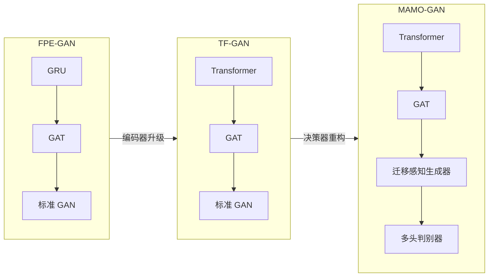
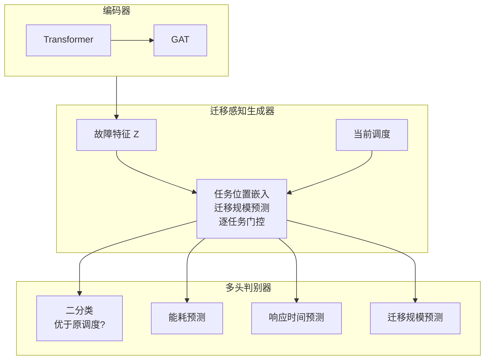

# 第4章 基于Transformer和多目标优化的改进方法（TF-GAN 与 MAMO-GAN）

## 4.1 改进动机与整体思路

第3章提出的 FPE-GAN 方法验证了“时空编码与对抗生成”范式在边缘计算容错迁移中的有效性。然而，随着边缘网络规模的扩大、任务复杂度的提升以及服务等级协议（SLA）的多样化，FPE-GAN 在长序列依赖建模精度与多目标决策权衡方面逐渐暴露出理论与实践的局限性。本章旨在剖析这些局限的根源，并提出两个渐进式的改进版本：TF-GAN（Transformer-based GAN）和 MAMO-GAN（Migration-Aware Multi-Objective GAN）。

### 4.1.1 FPE-GAN 的局限性分析

**1. GRU 在长序列依赖建模中的梯度瓶颈**
FPE-GAN 采用 GRU 处理时间序列。尽管 GRU 通过门控机制缓解了梯度消失问题，但在数学本质上，它仍属于递归神经网络（RNN）。根据 BPTT（Back Propagation Through Time）算法，梯度必须沿着时间步逐层反向传播。当时间窗口 $T$ 较大（例如 $T > 100$，对应数小时的高频监控数据）时，连乘项极易趋近于零或发散。这意味着模型难以捕捉早期的关键特征（如一天前的周期性负载波峰），导致对长周期故障模式的预测精度下降。

**2. 线性加权判别器的帕累托盲区**
FPE-GAN 的判别器采用线性加权和的方式评估策略质量（$\text{Score} = \sum w_i \cdot \text{Metric}_i$）。这种方法隐含地假设了各优化目标之间是线性可换算的。然而，在边缘计算中，时延（Latency）与能耗（Energy）往往呈现非凸的竞争关系。线性加权只能找到帕累托前沿（Pareto Frontier）**[55]** 上的凸点，而无法搜索到非凸区域的解，可能导致生成的策略在某一指标上表现极差（例如，为了极低的时延而消耗了过高的能量）。

**3. 缺乏成本感知的迁移震荡**
虽然 FPE-GAN 通过对抗训练能够在一定程度上缓解迁移震荡（判别器会间接惩罚长期不稳定的调度决策），但由于判别器采用线性加权方式评估策略质量，且未将"迁移行为本身"的开销显式纳入损失函数，在负载相近、网络条件波动时仍可能出现**迁移震荡（Migration Oscillation）**现象：即任务在两个负载相近的节点间反复迁移。虽然理论上两者负载均衡度相似，但频繁的上下文切换（Context Switching）和镜像传输消耗了大量带宽，反而降低了系统的实际可用性。因此，需要引入显式的迁移成本建模和迁移门控机制，从机制上根除无效的迁移震荡。

### 4.1.2 改进方案与演进架构

针对上述问题，本章提出如图 4-1 所示的改进路线，将改进分为“编码器升级”和“决策器重构”两个阶段：



*(图 4-1: 从 FPE-GAN 到 TF-GAN 再到 MAMO-GAN 的演进架构)*

1.  **TF-GAN（Transformer-based GAN）**：
    *   **核心改进**：将时序编码器由 GRU 升级为 **Transformer** **[32]**。
    *   **理论依据**：利用自注意力机制（Self-Attention）的全局感受野，使得任意两个时间步之间的路径长度为 $O(1)$，彻底解决长序列遗忘问题，并支持并行训练。

2.  **MAMO-GAN（Migration-Aware Multi-Objective GAN）**：
    *   **核心改进**：在 TF-GAN 基础上，引入**迁移门控（Migration Gate）**和**多头判别器（Multi-Head Discriminator）**。
    *   **理论依据**：将单目标优化转化为多目标博弈，引导生成器逼近帕累托最优解集，并显式抑制负收益的迁移操作。

## 4.2 基于 Transformer 的编码器设计（TF-GAN）

TF-GAN 的核心在于利用 Transformer 强大的序列建模能力替代 GRU。本节详细阐述改进后的编码器结构及其针对边缘时序数据的适配。

### 4.2.1 Transformer 编码器的数学模型

相比于 RNN/GRU 的递归处理，Transformer 采用完全基于注意力的架构。对于边缘节点 $i$ 的输入特征序列 $X_i \in \mathbb{R}^{T \times F}$，首先通过线性映射投影到模型维度 $d_{model}$。

**1. 位置编码（Positional Encoding）的适配**
由于 Transformer 不具备内在的时序感知能力（即打乱输入序列顺序不影响输出），必须注入位置信息。考虑到边缘负载数据的周期性，采用正弦位置编码（Sinusoidal PE）：

$$
\begin{aligned}
PE_{(pos, 2j)} &= \sin(pos / 10000^{2j/d_{model}}) \\
PE_{(pos, 2j+1)} &= \cos(pos / 10000^{2j/d_{model}})
\end{aligned}
$$

这种编码方式具有相对位置不变性，即 $PE_{pos+k}$ 可以表示为 $PE_{pos}$ 的线性变换，有助于模型学习时间步之间的相对距离依赖（如“故障通常发生在流量激增后的 5 分钟内”）。

**2. 多头自注意力机制（Multi-Head Self-Attention）**
这是 TF-GAN 捕捉长依赖的核心。对于第 $l$ 层，输入 $H^{(l-1)}$ 被投影到查询（Query）、键（Key）、值（Value）空间：
$$
Q = H^{(l-1)}W^Q, \quad K = H^{(l-1)}W^K, \quad V = H^{(l-1)}W^V
$$

缩放点积注意力（Scaled Dot-Product Attention）计算如下：
$$
\text{Attention}(Q, K, V) = \text{softmax}\left(\frac{QK^T}{\sqrt{d_k}}\right)V
$$

为了从不同子空间捕捉特征（例如，一个头关注长期周期性，另一个头关注短期突发性），采用多头机制：
$$
\text{MultiHead}(H) = \text{Concat}(\text{head}_1, ..., \text{head}_h)W^O
$$

**3. 前馈网络与层归一化**
每个注意力层后接一个前馈网络（FFN）：
$$
\text{FFN}(x) = \text{ReLU}(xW_1 + b_1)W_2 + b_2
$$

为了保证深层网络的训练稳定性，采用 **Pre-Norm** 结构（即在自注意力与前馈网络之前进行 LayerNorm），这比原始 Transformer 的 Post-Norm 结构在梯度传播上更稳定。对应的残差更新可写为：
$$
	ilde{x}_l = x_l + \text{MHA}(\text{LayerNorm}(x_l)),\qquad
x_{l+1} = \tilde{x}_l + \text{FFN}(\text{LayerNorm}(\tilde{x}_l))
$$

### 4.2.2 时空特征融合架构探讨

在引入 Transformer 后，如何将其与处理空间特征的 GAT 结合是一个关键问题。本研究对比了两种架构：

1.  **串联式（Series Architecture）**：先进行时序建模、再进行空间聚合：
    $X \xrightarrow{\text{Transformer}} H_{temp} \xrightarrow{\text{GAT}} Z$
    *   *逻辑*：先用自注意力从时间维度提取长程依赖与周期性模式，得到时间增强的节点表征；再利用 GAT 在拓扑图上聚合邻居信息，使表征具备空间上下文。
2.  **并行式（Parallel Architecture）**：时序与空间两路并行编码后再融合：
    $X \xrightarrow{\text{Transformer}} H_{temp},\quad X \xrightarrow{\text{GAT}} H_{spat},\quad Z=\phi([H_{temp}\|H_{spat}])$
    *   *逻辑*：将时序依赖与空间依赖视为相对独立的信息源，通过融合层进行整合。

**选择理由**：边缘系统中，节点间的影响关系不仅由静态拓扑决定，还受到当前负载状态的调制。串联式结构能够在较少的结构设计假设下，将“时间依赖”与“空间交互”逐级注入表征过程；结合本章图 4-1 与图 4-2 的整体设计，本文采用“**Transformer 串联 GAT**”的编码方式。

### 4.2.3 在线推理与模型更新机制

边缘环境存在**概念漂移（Concept Drift）**现象（如用户行为模式随季节变化）。为了使 TF-GAN 适应这种变化，系统采用基于滑动窗口的在线更新策略。这并非复杂的增量学习算法，而是工程上必要的模型维护机制。

**算法 4-1：在线推理与轻量自适应策略**
```text
输入：预训练编码器 E、GAN 决策模块，近期历史缓冲 B（容量 K）
输入：当前观测 S_t，当前调度状态（或当前调度 S）
输出：每个调度间隔的迁移决策

1: 将 S_t 加入 B；若 |B|>K 则丢弃最旧样本
2: 由最近 L 个观测（L=3）构成当前窗口 X_t
3: 推理：用编码器 E(X_t) 得到异常概率与原型向量
4: 若未检测到异常，则保持基线调度决策
5: 否则生成候选新调度，仅当其被评估为更优时才接受

// 可选：训练阶段的轻量自适应
6: 周期性地（或每间隔一次）从 B 中采样小批量
7: 由近期统计量得到弱监督信号（如基于分位数的异常指标）
8: 用与离线训练相同的监督目标，对编码器 E 进行少量步数更新
```
该机制确保模型在长时间运行中，能够适应新的负载基线，防止因数据分布变化导致的预测失效。

## 4.3 基于多目标优化的迁移决策改进（MAMO-GAN）

MAMO-GAN 旨在解决 FPE-GAN 的单目标局限和迁移震荡问题。它在 TF-GAN 的编码器基础上，重构了生成器和判别器，引入了显式的多目标博弈机制。整体结构如图 4-2 所示。



*(图 4-2: MAMO-GAN 结构（迁移感知生成器与多头判别器）)*

### 4.3.1 多目标优化问题形式化

边缘计算迁移决策是一个典型的多目标优化问题（MOP）。为表述方便，将候选迁移决策（或候选调度方案）记为 $M$，并定义目标向量 $\mathbf{F}(M)$：
$$
\min_{M} \mathbf{F}(M) = [f_{lat}(M), f_{eng}(M), f_{cost}(M)]^T
$$
其中：
*   $f_{lat}$：平均任务完成时间（Makespan）。
*   $f_{eng}$：边缘节点集群的总能耗。
*   $f_{cost}$：迁移产生的网络带宽消耗和停机时间。

由于这些目标相互冲突，不存在单一最优解。我们的目标是训练 GAN 生成一组**非支配解（Non-dominated Solutions）**，即帕累托前沿 **[55]**。

### 4.3.2 迁移感知生成器与门控机制

为了抑制震荡，生成器必须感知“当前任务在哪里”以及“迁移是否值得”。

**1. 任务位置嵌入（Task Location Embedding）**
在生成器的输入中，除了故障特征 $Z$，还加入了当前任务分布向量 $L_{curr}$。

**2. 软硬结合的迁移门控（Migration Gate）**
本文采用“**迁移约束感知的调度增量生成**”来实现门控思想：生成器不仅输出候选调度增量，还为每个任务（或容器）预测一个迁移倾向系数，并预测该候选调度在当前间隔内可能引发的迁移规模，从而在生成阶段抑制“高频迁移/大规模迁移”。

具体而言，生成器首先对任务状态嵌入与当前调度进行投影，并通过交叉注意力（由故障嵌入引导调度更新）与自注意力（建模任务间依赖）得到融合表示 $H$。在此基础上：

- **迁移规模预测**：输出标量 $\widehat{c}\ge 0$，表示该间隔的迁移次数（或迁移规模）预测；
- **逐任务门控**：输出向量 $g\in[0,1]^{N_{task}}$，其中 $g_i$ 越大表示第 $i$ 个任务越倾向于保持稳定、降低迁移。

最终调度增量以门控系数进行缩放：
$$
\Delta S = \alpha \cdot \tanh(f(H)) \odot (1-\beta g) \odot \psi(\widehat{c}),\qquad S' = S + \Delta S
$$
其中 $\psi(\widehat{c})$ 为随预测迁移规模单调衰减的惩罚因子，用于在“预测迁移规模偏大”时整体缩小增量幅度。该机制使模型能够在生成阶段主动抑制无收益迁移，从而缓解迁移震荡。

### 4.3.3 多头判别器与多目标损失

MAMO-GAN 的判别器采用**共享表征 + 多任务输出头**的结构：在共享特征层提取“原始调度与候选调度”的联合表示后，同时输出：

- **二分类输出**：判断候选调度是否优于原始调度；
- **能耗预测输出**：回归预测候选调度对应的能耗；
- **响应时间预测输出**：回归预测候选调度对应的响应时间；
- **迁移规模预测输出**：回归预测候选调度引发的迁移次数（或迁移规模）。

训练时，判别器的损失由“分类损失 + 多个回归损失（归一化后加权求和）”构成，以避免不同量纲导致的梯度失衡。分类标签由仿真评估的综合得分确定，例如：
$$
\text{Score} = 0.8\cdot E + 0.2\cdot R + 0.01\cdot C
$$
其中 $E$ 为能耗，$R$ 为响应时间，$C$ 为迁移次数（或迁移规模）。当 $\text{Score}(S') \le \text{Score}(S)$ 时，认为候选调度更优。

生成器的目标不仅是“被判别器判为更优”，还要在能耗、响应时间与迁移规模约束下生成可接受的候选调度。因此，生成器损失可写为：
$$
\mathcal{L}_G=\mathcal{L}_{cls} + \lambda_E \mathcal{L}_E + \lambda_R \mathcal{L}_R + \lambda_C \mathcal{L}_C
$$
其中 $\mathcal{L}_E$ 表示能耗约束项（鼓励不高于基线），$\mathcal{L}_R$ 表示 SLA 约束项（惩罚超过阈值的响应时间），$\mathcal{L}_C$ 表示迁移规模约束项（惩罚超过阈值的迁移次数），从而在多目标之间实现可控权衡。

### 4.3.4 冷却期（Cooldown）控制策略

除模型层面的迁移约束外，本文在推理阶段进一步引入“**三层迁移控制机制**”，用于抑制迁移震荡并限制迁移预算：

1. **冷却期约束**：对每个任务维护最近一次迁移的时间戳；若距离上次迁移未超过冷却期阈值，则该任务在当前间隔内禁止迁移。
2. **每步迁移上限**：对候选迁移按优先级排序，仅执行前 $M$ 个迁移动作，避免单次间隔内发生大规模迁移导致系统扰动。
3. **全局迁移预算**：在评估阶段设定总迁移次数上限，当累计迁移达到预算后，后续间隔不再执行迁移。

此外，当生成器对当前间隔的迁移规模预测过高时，可进一步收紧“每步迁移上限”，以实现更强的抑制效果。该推理侧控制与模型内生约束相互补充，能够显著降低迁移震荡风险。

### 4.3.5 MAMO-GAN 训练流程

**算法 4-2：MAMO-GAN 训练流程**
```text
输入：编码器离线预训练用数据集（标签由 ADE 生成，见 §2.3.5）；GAN 在线训练用交互轨迹
输出：多目标生成器与判别器

// 阶段2（编码器离线训练，监督/弱监督）
1: 用异常分类损失与基于原型的度量学习损失，对 Transformer 编码器训练固定轮数

// 阶段2（在线多目标 GAN 训练，仅异常触发时更新）
2: For 每个调度间隔 do
3:     运行编码器得到异常概率与原型向量
4:     If 未检测到异常 then 跳过 GAN 训练并保持基线决策
5:     Else:
6:         用迁移感知生成器生成候选调度
7:         获取仿真反馈（能耗、响应时间、迁移次数）
8:         用分类损失与回归损失更新多目标判别器
9:         用分类目标与多目标约束更新生成器

// 可选：训练期间对编码器进行轻量自适应
10:    用近期历史样本对编码器进行少量步数更新
```

## 4.4 理论分析与工程考虑

### 4.4.1 复杂度与收敛性分析

**1. 计算复杂度分析**
*   **TF-GAN**：Transformer 自注意力的理论复杂度与序列长度平方相关，但本文实验设置下时间窗口较短（$L=3$），因此额外开销可控；同时自注意力具备更好的并行性与表示能力，为后续扩展更长窗口提供结构基础。
*   **MAMO-GAN**：相比 TF-GAN，MAMO-GAN 在生成器侧引入注意力融合与迁移约束分支，在判别器侧引入多任务输出头，参数量与计算量有所增加，但整体仍保持轻量级，满足间隔级决策的实时性需求。

**2. 纳什均衡与收敛性**
多目标 GAN 的训练本质上是寻找一个广义纳什均衡（Generalized Nash Equilibrium）。虽然理论上难以保证全局收敛，但通过**共享特征层**（Shared Feature Layer）的设计，三个判别头实际上是在同一个特征流形上进行约束，这限制了搜索空间，提高了收敛稳定性。实验中观察到，损失函数在编码器与 GAN 训练若干轮后趋于稳定（具体轮数与配置见第 5 章）。

### 4.4.2 仿真实现的关键技术

在第 5 章的仿真实验中，为了确保 MAMO-GAN 的有效实现，采用了以下关键技术：
1.  **多目标损失归一化**：对能耗、响应时间与迁移规模的回归损失进行尺度归一化，避免不同量纲造成训练不稳定。
2.  **保守触发与早退出**：仅在检测到异常时启动对抗训练与策略更新；若判别器认为候选调度不优，则回退到基线决策，避免无效迁移。
3.  **推理侧迁移控制**：通过冷却期、每步迁移上限与全局迁移预算等机制约束迁移频率，提升策略鲁棒性并缓解迁移震荡。

## 4.5 本章小结

本章针对 FPE-GAN 存在的长序列遗忘、多目标冲突和迁移震荡问题，提出了 TF-GAN 和 MAMO-GAN 两种改进方法。
1.  **TF-GAN** 通过引入 Transformer 编码器与位置编码，以自注意力替代递归结构，提高了时序表示能力与并行性，并为扩展更长时间窗口提供了结构基础。
2.  **MAMO-GAN** 通过迁移约束感知的生成机制与多任务判别器设计，实现能耗、时延与迁移规模之间的联合权衡，并结合推理阶段的迁移控制机制显著缓解迁移震荡风险。

理论分析表明，改进后的方法在保持可接受计算复杂度的同时，显著提升了决策的鲁棒性和全面性。下一章将通过广泛的仿真实验，对上述方法的性能进行定量验证。