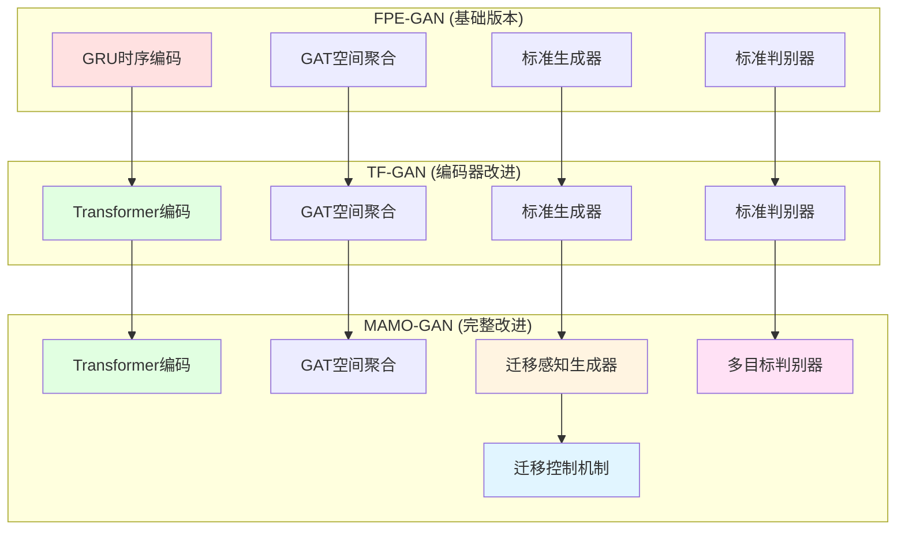
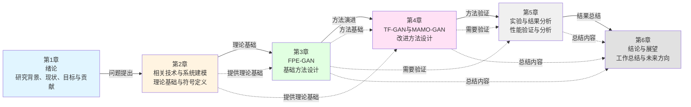

第1章 绪论

目标篇幅：约3000–4000字

随着物联网（Internet of Things, IoT）设备的爆炸式增长，边缘计算技术得到了快速发展，越来越多的计算任务被部署到网络边缘，以降低延迟、减少带宽消耗并提高数据隐私保护。然而，边缘计算环境中的节点资源受限、网络环境复杂多变，故障频发导致服务中断、SLA（Service Level Agreement）违约和系统不可用等问题日益突出。传统的被动容错方法（如检查点恢复、任务重新提交）在故障发生后才采取应对措施，往往无法满足关键应用对实时性和可靠性的严格要求。因此，研究主动容错机制，通过故障预测和抢占式迁移在故障发生前采取预防措施，已成为边缘计算领域的重要研究方向。

1.1 研究背景与意义

#### 1.1.1 物联网与边缘计算的发展

近年来，物联网技术得到了快速发展，全球联网设备数量呈指数级增长。据预测，到 2025 年，全球物联网设备数量将超过 750 亿台，产生的数据量将达到 79.4 ZB（Zettabyte）。这些设备产生的海量数据需要实时处理和分析，传统的云计算模式面临着严重的延迟、带宽和隐私问题。

边缘计算作为一种新兴的分布式计算范式，将计算资源部署在靠近数据源的网络边缘，有效解决了云计算的局限性。边缘计算具有以下优势：（1）**低延迟**：数据处理在边缘节点完成，避免了数据上传到云端的长距离传输，显著降低了响应时间；（2）**带宽节省**：大量数据在边缘处理，减少了网络带宽消耗；（3）**隐私保护**：敏感数据可以在本地处理，无需上传到云端，提高了数据安全性；（4）**离线能力**：边缘节点可以在网络断开时继续提供服务，提高了系统的鲁棒性。

然而，边缘计算也面临着严峻的挑战。边缘节点通常资源受限（计算能力、存储容量、电池容量有限），网络环境复杂多变（信号干扰、网络故障频发），且缺乏专业维护，导致系统可靠性较低。这些特点使得边缘计算环境中的故障预测和容错迁移成为亟待解决的关键问题。

#### 1.1.2 边缘计算面临的挑战

边缘计算环境中的容错问题具有以下特点：

**资源受限**：边缘节点（如 Raspberry Pi、嵌入式设备）的计算能力、内存容量和存储空间远小于云数据中心。例如，本实验使用的 Raspberry Pi 4B 节点，CPU 性能约为 4029 MIPS（Million Instructions Per Second），内存容量仅为 4GB 或 8GB。这种资源限制使得节点在负载峰值时容易出现过载，导致服务中断。

**网络环境复杂**：边缘节点部署在分布式环境中，网络连接不稳定，信号干扰频繁，节点可能因网络故障、硬件故障或电源问题而断开连接。这种不确定性要求系统具备强大的容错能力，能够在节点故障时快速恢复服务。

**系统可靠性要求高**：边缘计算广泛应用于关键场景，如自动驾驶、远程医疗、工业物联网等，这些应用对系统可靠性有极高的要求。服务中断可能导致严重后果，甚至危及生命安全。因此，传统的被动容错方法（故障发生后再恢复）无法满足这些应用的需求。

#### 1.1.3 关键应用场景

边缘计算在多个关键应用场景中发挥着重要作用，这些场景对系统可靠性提出了严格要求：

**自动驾驶**：自动驾驶车辆需要在毫秒级时间内做出决策，任何服务中断都可能导致交通事故。边缘计算节点部署在车辆或路侧，需要实时处理传感器数据，进行障碍物检测、路径规划等任务。节点故障可能导致车辆失去控制，因此需要主动容错机制，在故障发生前将任务迁移到其他节点。

**远程医疗**：远程医疗系统通过边缘节点实时监测患者生命体征，进行疾病诊断和治疗建议。系统故障可能导致患者生命危险，因此需要极高的可靠性。主动容错机制能够预测节点故障，提前迁移关键任务，确保医疗服务不中断。

**工业物联网**：工业物联网系统通过边缘节点监控生产线状态，进行质量控制和故障预警。系统故障可能导致生产线停工，造成巨大经济损失。主动容错机制能够预测节点故障，提前迁移监控任务，确保生产线的连续运行。

#### 1.1.4 研究意义

主动容错机制通过故障预测和抢占式迁移，能够在故障发生前采取预防措施，避免服务中断，提高系统可靠性。相比被动容错方法，主动容错具有以下优势：（1）**预防性**：在故障发生前采取行动，避免服务中断；（2）**高效性**：抢占式迁移可以在系统负载较低时进行，减少迁移对系统性能的影响；（3）**可靠性**：提前迁移关键任务，确保服务连续性。

本文研究的价值主要体现在以下几个方面：（1）提出了基于深度学习的故障预测方法，能够准确预测边缘节点故障；（2）设计了基于生成对抗网络的迁移决策生成方法，能够生成高质量的迁移策略；（3）实现了多目标优化，在能耗、响应时间和迁移成本之间取得平衡。这些研究成果为边缘计算环境中的主动容错提供了新的思路和方法。

1.2 国内外研究现状

#### 1.2.1 面向分布式计算的容错方法

容错方法可以分为反应式容错和主动式容错两大类。

**反应式容错方法**在故障发生后采取恢复措施，主要包括：（1）**检查点恢复**：定期保存系统状态，故障后从最近的检查点恢复；（2）**任务复制**：将任务复制到多个节点，故障时使用备份节点；（3）**任务重新提交**：故障后重新提交任务到其他节点。反应式容错方法的优点是实现简单，缺点是故障恢复时间长，可能导致服务中断。

**主动式容错方法**通过故障预测和抢占式迁移，在故障发生前采取预防措施，主要包括：（1）**故障预测**：基于历史数据预测节点故障；（2）**抢占式迁移**：在故障发生前将任务迁移到其他节点。主动式容错方法的优点是能够避免服务中断，缺点是实现复杂，需要准确的故障预测。

**代表性方法综述**：

**DFTM（Dynamic Fault-Tolerant Migration）**：Sivagami等人提出了一种动态容错迁移方法，该方法使用 LOESS（Locally Weighted Scatterplot Smoothing）回归预测主机利用率，当预测利用率超过阈值时触发迁移。该方法简单有效，但预测精度有限，难以处理复杂的故障模式。

**PCFT（Proactive Container Fault Tolerance）**：Liu等人提出了一种主动协调容错方法，该方法使用线性回归预测主机状态，选择最优目标主机进行迁移。该方法计算开销小，但预测能力有限，迁移决策质量不高。

**ECLB（Energy-Conscious Load Balancing）**：Sharif等人提出了一种节能检查点和负载均衡技术，该方法使用线性预测和贝叶斯优化进行负载均衡和能耗优化。该方法关注能耗优化，但故障预测能力较弱，迁移次数较多。

**CMODLB（Container Migration Optimization for Dynamic Load Balancing）**：Negi等人提出了一种基于聚类的多目标动态负载均衡技术，该方法使用 FCN（Fully Convolutional Network）编码器进行故障预测，然后进行容器迁移优化。该方法引入了深度学习技术，但编码器结构简单，难以捕获复杂的时空依赖关系。

**表 1-1 传统容错方法对比**

| 方法 | 故障预测技术 | 迁移策略 | 优点 | 缺点 |
|------|------------|---------|------|------|
| DFTM | LOESS 回归 | MMT + FirstFit | 实现简单 | 预测精度有限 |
| PCFT | 线性回归 | FirstFit | 计算开销小 | 预测能力弱 |
| ECLB | 线性预测 | 贝叶斯优化 | 能耗优化 | 迁移次数多 |
| CMODLB | FCN 编码器 | MMT + FirstFit | 引入深度学习 | 编码器结构简单 |

#### 1.2.2 面向边缘计算的故障预测方法

故障预测是主动容错的关键环节，准确的故障预测能够使系统在故障发生前采取预防措施。故障预测方法可以分为三类：

**基于统计分析的方法**：使用统计技术（如主成分分析 PCA、动态主成分分析 diPCA）分析系统指标，识别异常模式。这些方法计算开销小，但难以处理复杂的非线性关系，预测精度有限。

**基于数学模型的方法**：使用概率模型、模糊神经网络等数学模型建模系统行为，预测故障。这些方法具有一定的理论基础，但模型参数难以确定，适应性较差。

**基于人工智能的方法**：使用机器学习技术（如支持向量机 SVM、长短期记忆网络 LSTM、卷积神经网络 CNN）学习故障模式，预测故障。这些方法能够处理复杂的非线性关系，但需要大量训练数据，且模型解释性较差。

近年来，深度学习方法在故障预测领域取得了显著进展。LSTM 网络能够处理时间序列数据，捕获长期依赖关系；Transformer 架构通过自注意力机制，能够并行处理序列数据，提高训练效率；图神经网络（GNN）能够建模节点间的复杂关系，适用于分布式系统。然而，现有方法仍存在以下不足：（1）**长序列依赖捕捉能力不足**：LSTM 存在梯度衰减问题，难以处理长序列；（2）**空间依赖建模不足**：大多数方法仅考虑时间依赖，忽略了节点间的空间关系；（3）**多目标优化困难**：现有方法通常只优化单一目标，难以在多个目标之间取得平衡。

#### 1.2.3 面向边缘计算的计算迁移方法

计算迁移是容错的关键机制，通过将任务从故障节点迁移到健康节点，确保服务连续性。迁移方法可以分为三类：

**传统迁移方法**：使用轮询调度、启发式算法（如 FirstFit、BestFit）选择目标节点。这些方法实现简单，但迁移决策质量不高，可能导致负载不均衡或迁移成本过高。

**基于深度强化学习的方法**：使用深度强化学习（如 DQN、DDQN）学习迁移策略，通过与环境交互不断优化决策。这些方法能够学习复杂的迁移策略，但训练时间长，需要大量交互数据，且存在训练不稳定问题。

**基于优化算法的方法**：使用优化算法（如粒子群优化 PSO、遗传算法）求解迁移优化问题。这些方法能够找到近似最优解，但计算开销大，难以满足实时决策要求。

现有迁移方法存在以下不足：（1）**迁移震荡问题**：缺乏对迁移历史的感知，可能在同一任务上反复迁移，导致不必要的迁移成本；（2）**多目标平衡困难**：难以同时优化能耗、响应时间和迁移成本等多个目标；（3）**动态环境适应性差**：难以适应系统状态的动态变化，迁移决策质量不稳定。

#### 1.2.4 现有研究的不足

综合以上分析，现有研究存在以下主要不足：

**长序列依赖捕捉能力不足**：现有故障预测方法（如 LSTM）在处理长序列时存在梯度衰减问题，难以有效利用长期历史信息。某些故障模式具有周期性特征，需要观察多个周期才能准确预测，但现有方法难以捕获这种长期模式。

**多目标平衡困难**：现有迁移方法通常只优化单一目标（如能耗或响应时间），难以在多个目标之间取得平衡。在实际场景中，系统往往需要在能耗、响应时间和迁移成本之间进行权衡，单一目标优化可能无法找到帕累托最优解。

**迁移震荡问题**：现有方法缺乏对迁移历史的感知，可能在同一任务上反复迁移，导致不必要的迁移成本。缺乏迁移频率控制机制，无法避免短时间内的多次迁移，影响系统稳定性。

**动态环境适应性差**：现有方法难以适应系统状态的动态变化，迁移决策质量不稳定。缺乏在线学习机制，无法根据实时观测调整迁移策略。

**故障类型覆盖不全面**：现有方法通常只关注特定类型的故障（如节点过载），难以处理多种故障类型（如网络故障、硬件故障、软件故障等）。

1.3 本文研究目标与主要贡献

#### 1.3.1 研究目标

针对现有研究的不足，本文的研究目标包括：

**目标一：提高故障预测准确率**。通过设计基于深度学习的故障预测编码器，结合时序特征和空间特征，提高故障预测的准确率。编码器需要能够捕获长期依赖关系和节点间的复杂关系，准确识别故障模式。

**目标二：生成高质量迁移决策**。通过设计基于生成对抗网络的迁移决策生成方法，学习从故障特征到迁移策略的映射关系，生成高质量的迁移决策。生成器需要能够考虑系统状态、资源约束和迁移成本，生成最优的迁移策略。

**目标三：实现多目标优化平衡**。通过设计多目标判别器和迁移感知机制，在能耗、响应时间和迁移成本之间取得平衡。系统需要能够同时优化多个目标，找到接近帕累托最优的解决方案。

#### 1.3.2 主要贡献

本文的主要贡献包括：

**贡献一：提出了 FPE-GAN 方法**。FPE-GAN（Fault Prediction and Embedding based GAN）是首个将生成对抗网络应用于边缘计算容错迁移的方法。该方法设计了基于 GRU 和 GAT 的时空特征编码器，能够同时捕获时序动态和空间拓扑依赖，准确预测故障。然后使用生成对抗网络在潜在空间中生成优化的迁移策略，实现主动容错的抢占式迁移。

**贡献二：提出了 TF-GAN 方法**。TF-GAN（Transformer-based Fault GAN）将 FPE-GAN 的 GRU 编码器替换为 Transformer 编码器，提升了长序列建模能力。Transformer 采用自注意力机制，能够并行处理所有时间步，直接建模任意两个时间步之间的依赖关系，不受梯度衰减影响。实验表明，TF-GAN 的异常检测准确率相比 FPE-GAN 提升约 2-3%，且训练时间减少约 20%。

**贡献三：提出了 MAMO-GAN 方法**。MAMO-GAN（Migration-Aware Multi-Objective GAN）在 TF-GAN 的基础上，引入迁移感知生成器和多目标判别器，实现了多目标优化。迁移感知生成器通过迁移成本预测和迁移门控机制，在生成调度方案时考虑迁移成本，减少不必要的迁移。多目标判别器同时预测能量、响应时间和迁移成本三个目标，使生成器能够同时优化多个指标，更接近帕累托前沿。实验表明，MAMO-GAN 相比 TF-GAN 在能耗、响应时间和 SLA 违约率方面都有显著改善。

**贡献四：进行了全面的实验验证**。在 RPiEdge 仿真环境中进行了大量实验，对比了 FPE-GAN、TF-GAN、MAMO-GAN 与传统方法（CMODLB、DFTM、ECLB、PCFT）的性能。实验结果表明，MAMO-GAN 在多个性能指标上都取得了最佳平衡，验证了方法的有效性。

**贡献五：进行了消融实验和参数敏感性分析**。通过消融实验分析了各个组件的贡献，验证了 Transformer 编码器、迁移感知机制和多目标优化的有效性。通过参数敏感性分析，确定了最优的超参数配置，为实际部署提供了指导。

#### 1.3.3 创新点

本文的创新点主要体现在以下几个方面：

**创新点一：时空特征编码与 GAN 的结合**。首次将时空特征编码（GRU + GAT）与生成对抗网络结合，用于边缘计算的容错迁移。这种设计既利用了深度学习的表示能力捕捉复杂时空依赖，又通过对抗训练提高生成策略的多样性与鲁棒性。

**创新点二：Transformer 在故障预测中的应用**。首次将 Transformer 架构应用于边缘计算的故障预测任务，提升了长序列建模能力。Transformer 的自注意力机制能够直接建模任意两个时间步之间的依赖关系，不受梯度衰减影响，相比 GRU 具有显著优势。

**创新点三：迁移感知的多目标判别器**。设计了迁移感知生成器和多目标判别器，实现了多目标优化。迁移感知生成器通过迁移成本预测和迁移门控机制，在生成阶段就考虑迁移成本；多目标判别器同时预测多个性能指标，使生成器能够同时优化多个目标，更接近帕累托前沿。

1.4 技术路线与论文结构

#### 1.4.1 技术路线

本文的技术路线采用渐进式改进策略，从基础方法 FPE-GAN 开始，逐步改进到 TF-GAN 和 MAMO-GAN。具体而言，首先提出 FPE-GAN 作为基础方法，验证时空特征编码与 GAN 结合的有效性；然后提出 TF-GAN，将 GRU 编码器替换为 Transformer 编码器，提升长序列建模能力；最后提出 MAMO-GAN，引入迁移感知机制和多目标优化，实现最佳性能。技术路线如图 1-1 所示。

**图 1-1 方法演进路线图**

技术路线主要包含以下三个阶段：

**阶段一：FPE-GAN 基础方法**。设计基于 GRU 和 GAT 的时空特征编码器，结合标准生成对抗网络，实现基础的故障预测和迁移决策生成。该方法验证了时空特征编码与 GAN 结合的有效性，为后续改进奠定了基础。

**阶段二：TF-GAN 编码器改进**。将 GRU 编码器替换为 Transformer 编码器，提升长序列建模能力。该方法验证了 Transformer 在故障预测任务中的优势，相比 FPE-GAN 在异常检测准确率和训练效率方面都有显著提升。

**阶段三：MAMO-GAN 完整改进**。引入迁移感知生成器和多目标判别器，实现多目标优化。该方法验证了迁移感知机制和多目标优化的有效性，在能耗、响应时间和 SLA 违约率等多个指标上都实现了最佳性能。

#### 1.4.2 论文结构

本文共分为 6 章，各章内容及其相互关系如图 1-2 所示。

**图 1-2 论文结构图**

图 1-2 展示了本文的完整结构及各章节之间的逻辑关系：

**章节内容概述**：

**第 1 章 绪论**（蓝色）：作为论文的开篇，介绍研究背景与意义，综述国内外研究现状，指出现有研究的不足，阐述本文的研究目标、主要贡献和创新点，说明技术路线和论文结构。本章为后续章节提供研究动机和问题定义。

**第 2 章 相关技术与系统建模**（黄色）：介绍边缘计算与容器化的基本概念，阐述深度学习相关技术（GRU、Transformer、GAT、GAN），详细定义系统模型、符号表示以及问题形式化，讨论伦理、安全与数据隐私问题。本章为第 3、4 章的方法设计提供理论基础和符号体系。

**第 3 章 基于时空特征编码和生成对抗网络的主动迁移方法（FPE-GAN）**（绿色）：详细介绍 FPE-GAN 的设计与实现，包括总体架构、时空特征编码器设计、生成器与判别器设计、损失函数与训练策略、算法流程、复杂度分析与局限性。本章提出了基础方法，为第 4 章的改进奠定基础。

**第 4 章 基于 Transformer 和多目标优化的改进方法（TF-GAN 与 MAMO-GAN）**（粉色）：分析 FPE-GAN 的局限性，详细介绍基于 Transformer 的编码器设计（TF-GAN），阐述迁移感知生成器与多目标判别器的设计（MAMO-GAN），描述多目标训练算法，进行理论分析与实践考量。本章在 FPE-GAN 基础上进行改进，形成了最终的方法。

**第 5 章 实验与结果分析**（灰色）：详细介绍实验环境与设置，对比 FPE-GAN 与传统方法的性能，对比 TF-GAN 与 FPE-GAN 的性能，对比 MAMO-GAN 与 FPE-GAN 的性能，进行消融实验和参数敏感性分析，分析系统开销，讨论结果与失败案例。本章验证了第 3、4 章提出的方法的有效性。

**第 6 章 结论与展望**（浅灰色）：总结本文的主要工作和贡献，指出研究的局限性，展望未来的研究方向。本章对全文进行总结，并为后续研究提供方向。

**章节间的逻辑关系**：

- **顺序关系**（实线箭头）：各章节按照"问题提出→理论基础→方法设计→实验验证→总结展望"的逻辑顺序展开，形成完整的论文结构。

- **支撑关系**（虚线箭头）：
  - 第 2 章为第 3、4 章提供理论基础和符号体系
  - 第 3 章为第 4 章提供方法演进的基础
  - 第 3、4 章为第 5 章提供需要验证的方法
  - 第 3、4、5 章为第 6 章提供总结的内容

这种结构设计确保了论文的逻辑性和完整性，各章节相互支撑，共同构成了一个完整的研究体系。

1.5 本章小结

本章首先介绍了物联网与边缘计算的发展背景，阐述了边缘计算的优势与面临的挑战，分析了关键应用场景对系统可靠性的严格要求，说明了主动容错机制的研究意义。然后综述了国内外研究现状，包括面向分布式计算的容错方法、面向边缘计算的故障预测方法和计算迁移方法，指出了现有研究在长序列依赖捕捉、多目标平衡、迁移震荡和动态环境适应性等方面的不足。接着阐述了本文的研究目标、主要贡献和创新点，说明了技术路线和论文结构。

针对现有研究的不足，本文提出了三个渐进式改进的方法：FPE-GAN、TF-GAN 和 MAMO-GAN。这些方法通过时空特征编码、Transformer 长序列建模和迁移感知多目标优化，在故障预测准确率、迁移决策质量和多目标平衡方面取得了显著进展。后续章节将详细介绍这些方法的设计、实现和实验结果。
